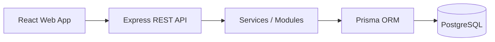

# Suzume

> **A personal placement command center for applications, interviews, preparation, and learnings.**

Suzume brings the placement journey into one connected platform — from tracking opportunities and interview rounds to recording experiences, improving preparation, and learning from every interview.

##  Why Suzume?

Placement preparation is usually scattered across spreadsheets, calendars, notes, coding platforms, and messages.

Suzume connects them:

```text
Application
     ↓
Interview
     ↓
Experience
     ↓
Learning
     ↓
Preparation
     ↓
Analytics
```

The goal is simple: **track the journey, learn from it, and prepare better for what comes next.**

---

##  Features

###  Application Tracking
Track companies, roles, deadlines, status, stipend, CTC, PPO details, notes, and application sources.

###  Smart Application Extraction
Paste a placement email or notice and extract useful application details into a structured form.

###  Interview Tracking
Manage multiple interview rounds, schedules, statuses, questions, and experiences for every application.

###  Learnings & Action Items
Record what you learned from interviews and turn those lessons into things to improve.

###  Preparation Tracker
Create and track preparation subjects, daily study logs, progress, recent topics, and preparation activity.

###  Calendar & Activity Heatmap
Visualize interview schedules and study activity through a calendar and GitHub/LeetCode-style contribution heatmap.

###  Analytics
Understand application progress, interview outcomes, preparation activity, and learning trends.

---

##  Architecture



**Stack**

- React + TypeScript + Vite
- Node.js + Express + TypeScript
- Prisma ORM
- PostgreSQL / Supabase
- JWT Authentication
- Tailwind CSS
- pnpm Monorepo

Detailed documentation:

- [System Architecture](docs/architecture/system-architecture.md)
- [Database Schema](docs/database/schema.md)

---

##  Project Structure

```text
suzume/
├── apps/
│   ├── web/              # React frontend
│   └── api/              # Express backend
├── packages/             # Shared packages
├── docs/                 # Architecture & database docs
├── docker-compose.yml
├── package.json
└── pnpm-workspace.yaml
```

---

##  Run Locally

### Prerequisites

- Node.js 20+
- pnpm
- PostgreSQL or a Supabase project

### 1. Clone

```bash
git clone https://github.com/GaliAkshatha/suzume.git
cd suzume
```

### 2. Install dependencies

```bash
pnpm install
```

### 3. Configure environment variables

Create the required `.env` files using the provided `.env.example` files.

The API requires:

```env
DATABASE_URL=
DIRECT_URL=
JWT_ACCESS_SECRET=
JWT_REFRESH_SECRET=
PORT=4000
CLIENT_URL=http://localhost:5173
```

The web app requires:

```env
VITE_API_BASE_URL=http://localhost:4000/api
```

### 4. Set up the database

```bash
pnpm db:migrate
```

### 5. Start Suzume

```bash
pnpm dev
```

Open:

```text
http://localhost:5173
```

API:

```text
http://localhost:4000
```

---

##  Security

- JWT-based authentication
- Hashed passwords
- Protected API routes
- User-scoped data access
- Environment-based secrets
- No database credentials committed to source control

---

##  Future Scope

- External preparation sources such as LeetCode
- Email-based application detection
- Smarter preparation recommendations
- Interview question pattern analysis
- Automated application tracking
- Personalized preparation plans

---

##  Author

**Gali Akshatha**

[GitHub](https://github.com/GaliAkshatha)
