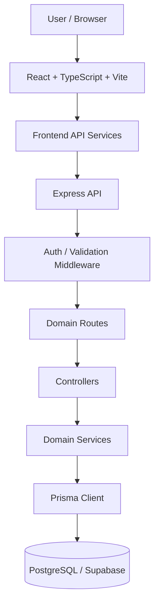
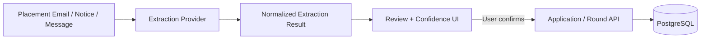

# Suzume — Placement Journey & Learning Tracker

> A personal system for tracking applications, recruitment rounds, interview experiences, lessons, preparation, and long-term placement progress.

Suzume turns a scattered placement season—emails, application forms, interview notes, preparation logs, deadlines, and lessons—into one connected workspace.

**Core principle:** **Store once, derive everywhere.**

An application and its rounds are the source of truth. The dashboard, company timeline, calendar, and analytics derive their views from that same data instead of maintaining duplicate records.

---

## Why Suzume?

Placement preparation is usually spread across email, WhatsApp messages, spreadsheets, calendars, notes, and coding platforms. Suzume brings the important parts together:

- Track every application and its current status.
- Maintain a visual timeline of recruitment rounds.
- Record interview questions, performance, reflections, and experiences.
- Turn interview experiences into learnings and actionable follow-ups.
- Track preparation across default and custom subjects.
- Record daily study sessions and visualize activity with a calendar and heatmap.
- Paste placement notices or messages and extract application details before saving them.
- Track external preparation sources such as LeetCode through a provider-based integration model.
- Analyze recurring interview topics, preparation progress, and improvement areas.

---

## Product Flow

```text
Opportunity
    ↓
Application
    ↓
Recruitment Rounds
    ↓
Interview Experience
    ↓
Questions + Performance
    ↓
Learnings + Action Items
    ↓
Preparation
    ↓
Analytics
    ↓
Improvement for the Next Opportunity
```

---

## System Architecture

Suzume is implemented as a **modular monolith**: one React SPA, one Express API, and one PostgreSQL database accessed through Prisma.



The backend follows a clear request path:

```text
Route
  ↓
Middleware
  ↓
Controller
  ↓
Service
  ↓
Prisma
  ↓
PostgreSQL
```

Controllers handle HTTP concerns. Services contain business logic and user-ownership checks. Prisma is the database access layer.

See [`docs/architecture/system-architecture.md`](docs/architecture/system-architecture.md) for the detailed architecture and data flows.

---

## Extraction Flow

Suzume supports manual application entry and paste/extract entry. Both ultimately use the same application and round APIs.



The extraction endpoint is intentionally **read-only**. It does not write extracted data directly to the database. The user reviews the result and confirmation then goes through the same write path as manual entry.

The shipped parser is deterministic and dependency-light. A future AI-backed provider can be introduced behind the existing provider abstraction.

---

## Tech Stack

| Layer | Technology |
|---|---|
| Frontend | React 18, TypeScript, Vite, Tailwind CSS, React Router |
| Visualization | Recharts + custom preparation heatmap/calendar components |
| Backend | Node.js, Express, TypeScript |
| Database | PostgreSQL |
| ORM | Prisma |
| Validation | Zod |
| Authentication | JWT access/refresh tokens + bcryptjs |
| Session security | HTTP-only refresh-token cookie |
| Monorepo | pnpm workspaces |
| Production database | Supabase PostgreSQL |
| Frontend deployment | Vercel |
| Backend deployment | Render |

---

## Key Features

### Applications

- Manual application creation.
- Paste/extract application details from unstructured placement text.
- Company, role, location, internship, stipend, CTC, PPO, deadlines, status, notes.
- Duplicate/existing-application matching during extraction.

### Company Timeline

Track recruitment stages such as:

- Application submitted
- Shortlisted
- Online assessment
- Technical interview
- Managerial interview
- HR round
- Final result

Rounds automatically feed the dashboard and calendar.

### Interview Experiences

Record:

- What was asked
- Topics covered
- Difficulty
- Performance
- What went well
- What went badly
- Confidence
- Overall reflection

### Learnings & Action Items

Turn interview experiences into reusable lessons and track concrete actions until they are resolved.

### Preparation Tracker

- Default preparation subjects.
- User-created subjects.
- Initial preparation assessment.
- Current confidence/progress.
- Daily study logs.
- Questions solved and time spent.
- Study calendar.
- GitHub/LeetCode-inspired activity heatmap.
- External preparation-source architecture.

Initial preparation, Suzume study activity, and external platform activity are intentionally kept as separate signals rather than being collapsed into one misleading percentage.

### Analytics

Analytics are derived from existing domain data instead of a separate analytics database. This allows the application to surface patterns such as application progress, interview topics, preparation levels, and learning trends without duplicating the underlying records.

---

## Database Schema

Suzume uses PostgreSQL with Prisma. The main relationships are:

```mermaid
erDiagram
    USER ||--o{ APPLICATION : owns
    USER ||--o{ LEARNING : records
    USER ||--o{ PREPARATION_PROGRESS : tracks
    USER ||--o{ PREPARATION_LOG : records
    USER ||--o{ PREPARATION_SOURCE : connects
    USER ||--o{ REFRESH_TOKEN : has
    USER ||--o{ PASSWORD_RESET_TOKEN : requests

    COMPANY ||--o{ APPLICATION : receives
    APPLICATION ||--o{ ROUND : contains
    ROUND ||--o| EXPERIENCE : produces
    EXPERIENCE ||--o{ QUESTION : contains
    LEARNING ||--o{ ACTION_ITEM : contains

    PREPARATION_TOPIC ||--o{ PREPARATION_PROGRESS : has
    PREPARATION_TOPIC ||--o{ PREPARATION_LOG : receives
    PREPARATION_TOPIC ||--o{ PREPARATION_TOPIC : contains

    USER {
        uuid id PK
        string name
        string email UK
        string password_hash
        datetime preparation_setup_completed_at
        datetime created_at
        datetime updated_at
    }

    COMPANY {
        uuid id PK
        string name UK
        string website
        string description
        datetime created_at
        datetime updated_at
    }

    APPLICATION {
        uuid id PK
        uuid user_id FK
        uuid company_id FK
        string role
        string location
        datetime application_date
        datetime deadline
        boolean internship
        enum ppo_type
        decimal stipend
        decimal ctc
        enum status
        enum source
    }

    ROUND {
        uuid id PK
        uuid application_id FK
        enum type
        string title
        datetime scheduled_at
        int duration
        enum mode
        enum status
        enum source
    }

    EXPERIENCE {
        uuid id PK
        uuid round_id FK_UK
        string summary
        string what_went_well
        string what_went_badly
        int confidence
        string overall_reflection
    }

    QUESTION {
        uuid id PK
        uuid experience_id FK
        string question
        enum category
        string topic
        enum difficulty
        enum performance
        string notes
    }

    LEARNING {
        uuid id PK
        uuid user_id FK
        string title
        string description
        enum category
        enum priority
        enum status
    }

    ACTION_ITEM {
        uuid id PK
        uuid learning_id FK
        string title
        string description
        enum status
        datetime due_date
        datetime completed_at
    }

    PREPARATION_TOPIC {
        uuid id PK
        string name
        string category
        uuid parent_id FK
        uuid user_id FK
        boolean is_custom
    }

    PREPARATION_PROGRESS {
        uuid id PK
        uuid user_id FK
        uuid topic_id FK
        int initial_level
        int questions_solved
        int questions_total
        int confidence
        datetime last_practiced
    }

    PREPARATION_LOG {
        uuid id PK
        uuid user_id FK
        uuid topic_id FK
        date date
        int questions_solved
        int duration_minutes
        string notes
    }

    PREPARATION_SOURCE {
        uuid id PK
        uuid user_id FK
        string provider
        string profile_url
        json metrics
        datetime last_synced_at
        string last_sync_error
    }
```

See [`docs/database/schema.md`](docs/database/schema.md) and `apps/api/prisma/schema.prisma` for the database source of truth.

---

## Project Structure

```text
suzume/
├── apps/
│   ├── web/
│   │   └── src/
│   │       ├── app/              # App shell, routing, providers
│   │       ├── components/       # Shared UI and visual components
│   │       ├── features/         # Domain-specific reusable features
│   │       ├── pages/            # Route-level pages
│   │       ├── services/api/     # Backend API clients
│   │       └── hooks/             # Shared React hooks
│   │
│   └── api/
│       ├── prisma/               # Prisma schema + migrations + seed
│       └── src/
│           ├── config/           # Environment + Prisma setup
│           ├── middleware/       # Auth, validation, errors
│           ├── modules/          # Domain modules
│           └── routes/           # API route composition
│
├── packages/
│   ├── shared-types/             # Shared TypeScript types
│   └── validation/               # Shared Zod schemas
│
├── docs/
│   ├── architecture/
│   └── database/
│
├── render.yaml
├── docker-compose.yml
├── pnpm-workspace.yaml
└── package.json
```

---

## Authentication & Security

- Passwords are hashed with bcrypt.
- Short-lived JWT access tokens are held in frontend memory.
- Refresh tokens are stored in an HTTP-only cookie.
- Refresh-token hashes are persisted so sessions can be revoked.
- Password-reset tokens are stored as hashes with expiry and single-use semantics.
- User-scoped resources are authorized using the authenticated user identity rather than a client-supplied user ID.
- Production secrets are supplied through deployment environment variables and are never committed to Git.

---

## Local Development

### Prerequisites

- Node.js 18+
- pnpm 9+
- Docker, if using local PostgreSQL

### Install

```bash
pnpm install
```

### Local database

```bash
docker compose up -d
```

### Environment

Copy the API example file:

```bash
cp apps/api/.env.example apps/api/.env
```

For local development, configure the database and JWT secrets in `apps/api/.env`.

### Migrations

```bash
pnpm db:migrate
```

### Development server

```bash
pnpm dev
```

Frontend: `http://localhost:5173`

API: `http://localhost:4000`

Health check: `http://localhost:4000/health`

### Useful commands

```bash
pnpm build
pnpm db:migrate
pnpm db:generate
pnpm db:studio
pnpm --filter @suzume/api test
pnpm --filter @suzume/api typecheck
pnpm --filter @suzume/web typecheck
```

---

## Production Deployment

Suzume is deployed as two applications backed by one Supabase PostgreSQL database:

```text
GitHub
   ├──────────────→ Vercel
   │                   ↓
   │              Suzume Web
   │
   └──────────────→ Render
                       ↓
                   Suzume API
                       ↓
                  Supabase Postgres
```

### 1. GitHub

Commit the working V1 to the `main` branch. Do not commit `.env`, database passwords, JWT secrets, or `node_modules`.

```bash
git add .
git commit -m "Release Suzume V1"
git push origin main
```

### 2. Supabase

Use the Supabase connection strings from **Connect → Database**.

Because Render is IPv4-only, use Supabase's **Supavisor session-mode connection on port 5432** for the Render backend rather than the IPv6 direct connection. Supabase documents session mode on port 5432 as the option for persistent backends on IPv4 networks. citeturn3search0turn3search10

Set both `DATABASE_URL` and `DIRECT_URL` to the session-mode connection for this deployment. Keep the password out of Git.

### 3. Render API

Create a **Web Service** from the GitHub repository, using the `main` branch. Render supports Git-based automatic deployments and monorepo services. citeturn1search0turn1search1

Use:

```text
Root Directory: .
Runtime: Node
Build Command:
corepack enable && pnpm install --frozen-lockfile && pnpm --filter @suzume/api db:generate && pnpm --filter @suzume/api build

Start Command:
pnpm --filter @suzume/api db:migrate:deploy && pnpm --filter @suzume/api start
```

Environment variables:

```text
NODE_ENV=production
PORT=4000
DATABASE_URL=<Supabase session-mode 5432 connection>
DIRECT_URL=<Supabase session-mode 5432 connection>
JWT_ACCESS_SECRET=<long random secret>
JWT_REFRESH_SECRET=<different long random secret>
CLIENT_URL=<Vercel URL>
EMAIL_PROVIDER=console
EXTRACTION_PROVIDER=mock
```

Render web services must listen on `0.0.0.0`, so update the API entry point before deploying:

```ts
app.listen(env.port, "0.0.0.0", () => {
  console.log(`suzume api listening on port ${env.port}`);
});
```

Render documents that public web services need to bind to `0.0.0.0`. citeturn1search3

### 4. Vercel frontend

Import the same GitHub repository into Vercel. Vercel supports monorepos by selecting the application directory as the project's Root Directory. citeturn2search0

Set:

```text
Root Directory: apps/web
Framework: Vite
```

Enable access to workspace files outside the root directory because the frontend imports the shared workspace packages. Vercel documents this requirement for monorepos with dependencies outside the selected Root Directory. citeturn2search3

Add:

```text
VITE_API_BASE_URL=https://<your-render-api>.onrender.com/api
```

Deploy the project.

### 5. Connect CORS

Copy the Vercel production URL and set it as Render's:

```text
CLIENT_URL=https://<your-vercel-domain>
```

Redeploy the API.

### 6. Verify production

Check:

```text
GET https://<your-render-api>.onrender.com/health
```

Expected:

```json
{"status":"ok"}
```

Then open the Vercel URL and test:

- registration
- login
- application creation
- paste/extract flow
- calendar
- interview experience
- preparation logs
- analytics
- logout

---

## Continuous Deployment

Once GitHub is connected:

```text
Code change
    ↓
git add / commit / push
    ↓
GitHub main
    ↓
┌───────────────┬───────────────┐
↓               ↓               ↓
Vercel         Render        Production DB
Frontend       Backend       migrations
```

Vercel creates deployments from Git pushes, with the production branch serving the production deployment. Render also supports automatic redeployment from the connected Git branch. citeturn2search1turn1search5

For future database changes:

```bash
# Local development database
pnpm db:migrate

# Review the generated migration

# Commit migration + code
git add .
git commit -m "Add preparation source metrics"
git push origin main
```

Production uses `prisma migrate deploy`, so committed migrations are applied during deployment rather than running `prisma migrate dev` against production.

---

## License

Add the license you want to use before publishing the repository publicly.
