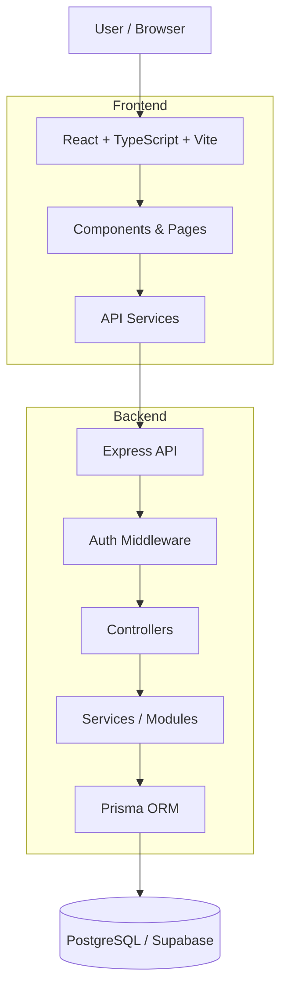
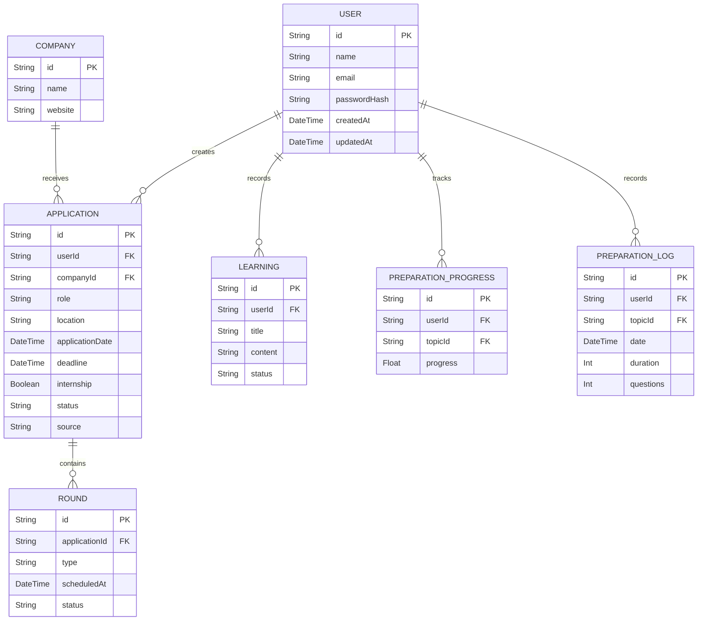

# Suzume — Placement & Preparation Tracker

A personal placement command center for tracking applications, interview rounds, preparation, experiences, and learnings — all in one place.

---

## Table of Contents

1. [Problem Statement](#problem-statement)
2. [ Solution](#solution)
3. [System Architecture](#system-architecture)
4. [Application Extraction Flow](#application-extraction-flow)
5. [Tech Stack](#tech-stack)
6. [Project Structure](#project-structure)
7. [Database Schema](#database-schema)
8. [Features](#features)
9. [Getting Started](#getting-started)
10. [Environment Variables](#environment-variables)

---

## Problem Statement

Placement preparation becomes difficult to manage when information is spread across multiple places:

- Applications are tracked in spreadsheets or notes
- Interview dates and rounds are easy to lose track of
- Questions and experiences are often forgotten after an interview
- Preparation progress is difficult to measure
- Lessons from previous interviews are not connected to future preparation
- Placement notices contain useful details that take time to enter manually

> **Result:** The placement journey becomes fragmented, making it harder to stay organized and learn from previous experiences.

---

## Solution

Suzume connects the complete placement workflow into a single system.

| Stage | What happens |
|---|---|
| Application | Add and track placement opportunities |
| Extraction | Paste placement information and extract useful details |
| Interview | Track rounds, schedules, questions, and outcomes |
| Experience | Record what happened during the process |
| Learning | Capture lessons and action items |
| Preparation | Track subjects, progress, and daily preparation |
| Analytics | Visualize application and preparation activity |

The idea is to turn placement history into a continuously improving preparation system.

---

## System Architecture



---

## Application Extraction Flow

Suzume can convert placement information from pasted text into structured application data.

```text
Placement Email / Notice
          │
          ▼
      Paste Text
          │
          ▼
      Extraction
          │
          ▼
 Structured Application
          │
          ▼
     Review / Edit
          │
          ▼
        Save
```

Information such as company, role, location, dates, internship details, stipend, CTC, PPO information, and source can be captured from the supplied text.

---

## Tech Stack

### Frontend

| Technology | Purpose |
|---|---|
| React | UI framework |
| TypeScript | Type safety |
| Vite | Build tool and development server |
| Tailwind CSS | Styling |

### Backend

| Technology | Purpose |
|---|---|
| Node.js | Runtime |
| Express | REST API |
| TypeScript | Type-safe backend |
| Prisma | Database ORM |
| JWT | Authentication |

### Database

| Technology | Purpose |
|---|---|
| PostgreSQL | Relational database |
| Supabase | Managed PostgreSQL |

### Development

| Technology | Purpose |
|---|---|
| pnpm | Package management |
| Docker | Local database support |
| Git | Version control |

---

## Project Structure

```text
suzume/
├── apps/
│   ├── web/
│   │   └── src/
│   │       ├── components/
│   │       ├── pages/
│   │       ├── services/
│   │       └── ...
│   │
│   └── api/
│       ├── prisma/
│       │   ├── migrations/
│       │   ├── schema.prisma
│       │   └── seed.ts
│       │
│       └── src/
│           ├── modules/
│           └── server.ts
│
├── packages/
├── docs/
├── docker-compose.yml
├── package.json
├── pnpm-lock.yaml
└── pnpm-workspace.yaml
```

---

## Database Schema

Suzume uses PostgreSQL through Prisma.

The main data flow is centered around the user and their placement journey:



The complete database definition is maintained in:

```text
apps/api/prisma/schema.prisma
```

---

## Features

### Authentication

- Account registration and login
- JWT authentication
- Protected API routes
- Password hashing
- Change password

### Application Management

- Add and edit applications
- Company and role information
- Application deadlines
- Internship / full-time details
- Stipend, CTC, and PPO information
- Application status tracking

### Interview Tracking

- Multiple rounds per application
- Round scheduling
- Round status
- Interview questions
- Interview experiences

### Smart Application Entry

- Paste placement emails or notices
- Extract application information
- Review extracted information before saving
- Manually edit extracted fields

### Preparation

- Default preparation topics
- Add custom topics
- Track preparation progress
- Daily preparation logs
- Preparation calendar
- Activity heatmap
- Recent topics

### Learnings & Analytics

- Record interview learnings
- Track action items
- Monitor preparation activity
- View placement statistics
- Understand preparation trends

---

## Getting Started

### Prerequisites

- Node.js 20+
- pnpm
- PostgreSQL or a Supabase PostgreSQL database

### 1. Clone the Repository

```bash
git clone https://github.com/GaliAkshatha/suzume.git
cd suzume
```

### 2. Install Dependencies

```bash
pnpm install
```

### 3. Configure Environment Variables

Create the required `.env` files using the provided `.env.example` files.

### 4. Generate Prisma Client

```bash
pnpm --filter @suzume/api exec prisma generate
```

### 5. Run Database Migrations

```bash
pnpm db:migrate
```

### 6. Start the Application

```bash
pnpm dev
```

Open the frontend at:

```text
http://localhost:5173
```

The API runs at:

```text
http://localhost:4000
```

---

## Environment Variables

### API

```env
DATABASE_URL=
DIRECT_URL=
JWT_ACCESS_SECRET=
JWT_REFRESH_SECRET=
PORT=4000
CLIENT_URL=http://localhost:5173
```

### Web

```env
VITE_API_BASE_URL=http://localhost:4000/api
```

Never commit real `.env` files or credentials to the repository.

---

## Documentation

Additional technical documentation is available in:

```text
docs/
├── architecture/
└── database/
```

---

## Built by

**Gali Akshatha**
