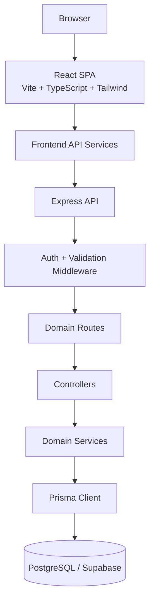
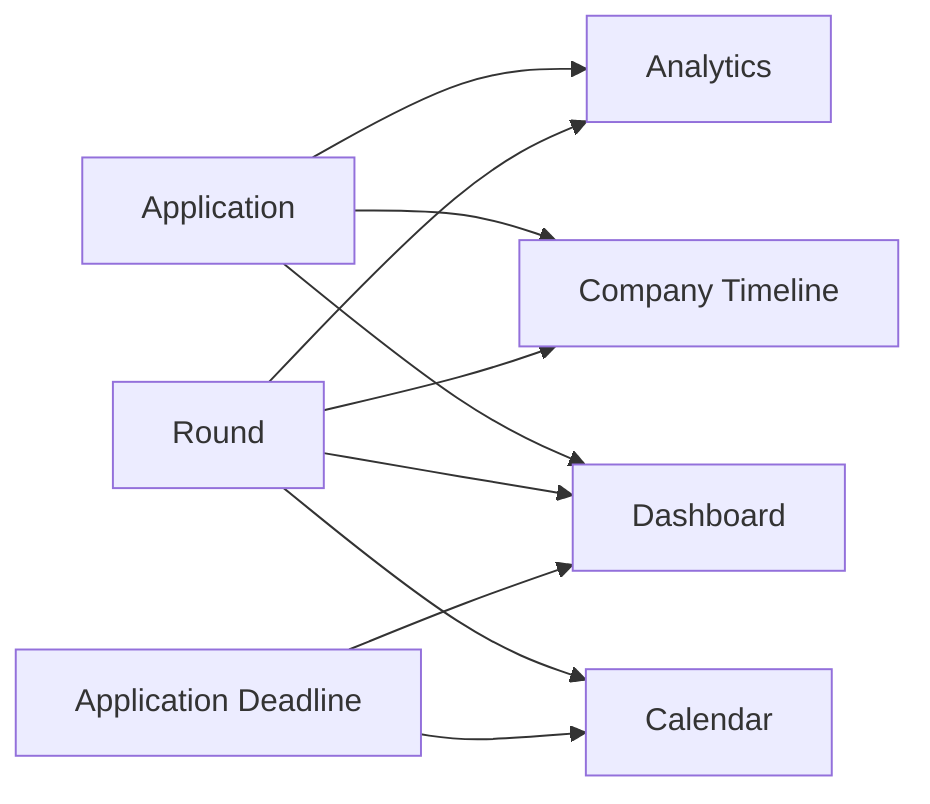
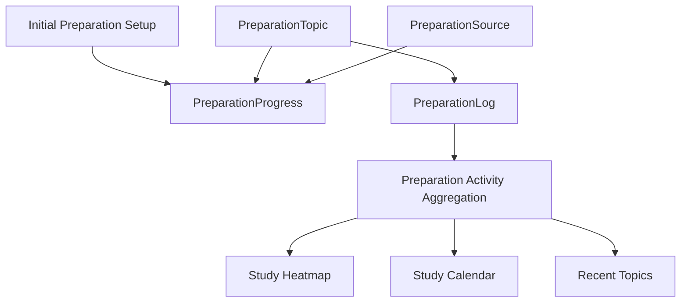
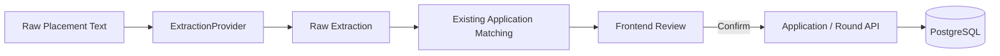
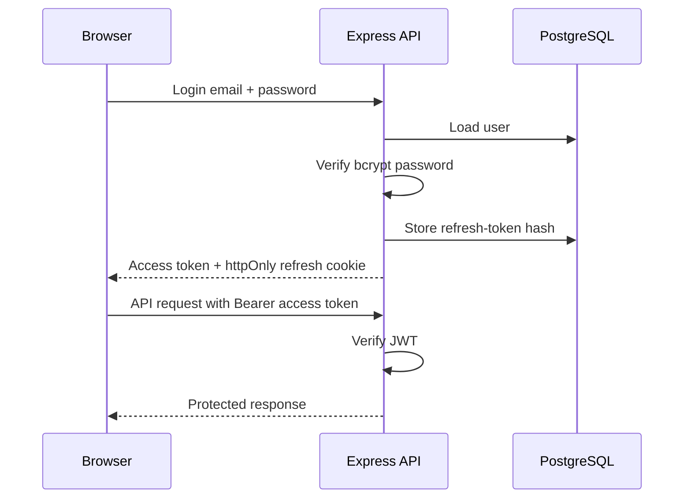

# Suzume System Architecture

## 1. High-Level Architecture

Suzume uses a modular-monolith architecture. The frontend and backend are separate applications inside one pnpm workspace, while the backend owns the domain logic and database access.



## 2. Domain Modules

```text
apps/api/src/modules/
├── auth/
├── companies/
├── applications/
├── rounds/
├── experiences/
├── questions/
├── learnings/
├── preparation/
├── dashboard/
├── calendar/
├── analytics/
└── extraction/
```

Each domain generally follows:

```text
routes → controller → service → Prisma
```

The controller is intentionally thin. Business rules and user ownership checks live in services.

## 3. Store Once, Derive Everywhere

The system avoids duplicated scheduling and analytics data.



There is no separate `Event` table. Calendar entries are derived from application deadlines and scheduled rounds.

## 4. Preparation Data Flow



`PreparationProgress` stores the user's preparation state and initial assessment. `PreparationLog` is the dated journal of actual study activity. External preparation sources are kept separate from Suzume-owned study history.

## 5. Extraction Pipeline



The extraction endpoint does not directly create database records. This keeps extraction safe and allows the same write path to be used for manual entry and future Gmail/WhatsApp integrations.

## 6. Authentication Flow



Access tokens are short-lived and held in frontend memory. Refresh tokens are stored in an HTTP-only cookie and persisted as hashes so sessions can be revoked.
